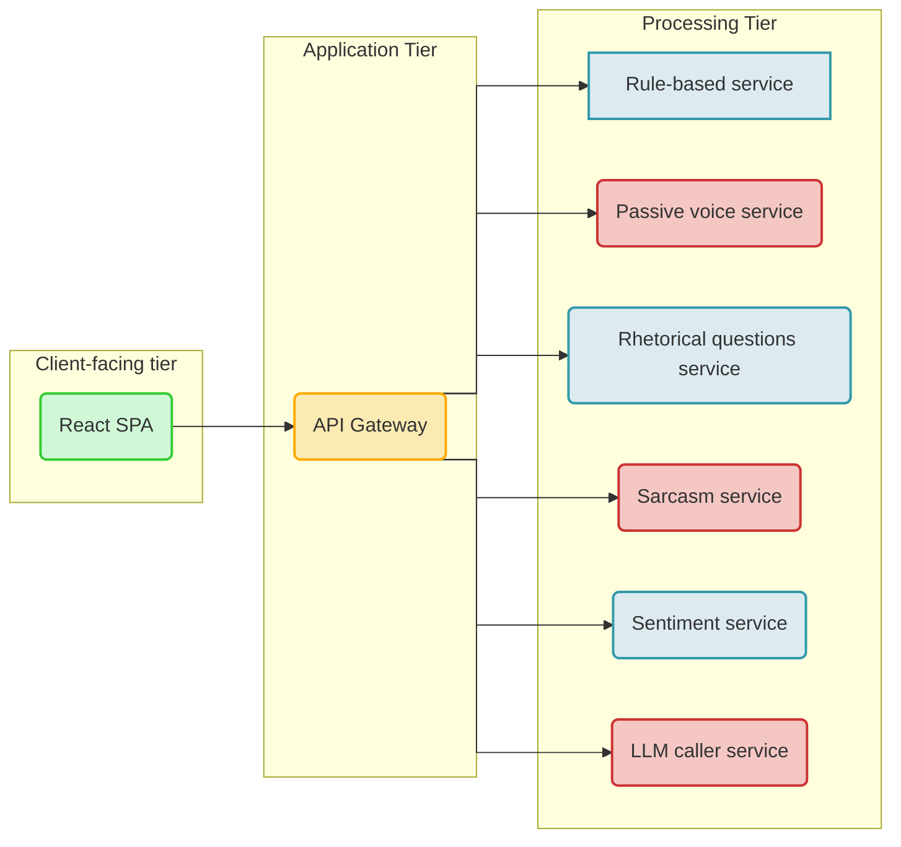
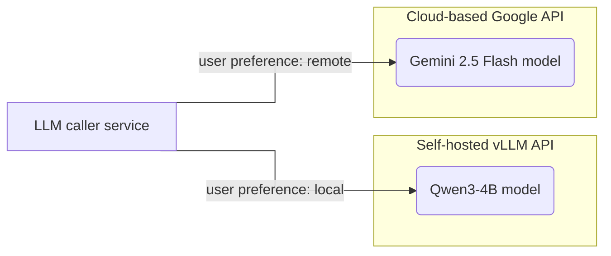

# Architecture & Self-Hosting

## Data Processing

### Data Sharing

None of the modules transmit data to 3rd parties, unless the user opts-in to use a remote cloud-based LLM.

### Explainability

Some modules are based on machine learning models. It should be noted these modules do not produce "explainable" results, a common point of discussion in machine learning known as "black box" behaviour.

### Flow of Data

The following diagram shows the flow of text input from the moment the user submits the text for analysis:



## Local and Remote LLMs

By default, the tool uses a self-hosted, fully private large language model running in a vLLM container, the industry standard for serving LLMs.

Users have the choice of opting into using a "remote" large language model, which can offer better performance for non-confidential data. Users are informed of data sharing upon selecting the remote model. Currently, the remote model is Gemini 2.5 Flash, hosted by Google. Use of data submitted with the remote option is governed by [Google's AI API terms](https://ai.google.dev/gemini-api/terms).



## Data Retention

The application does not retain any data that the user inputs. Any logs are stored in the working memory, refreshed whenever the containers are restarted, and only contain information like errors, time taken to do an analysis, and count of sentences and words.

## Self-Hosting the Application

The deliverable is constructed as a GitHub repository separated into services, all of which are containerised. A specification file for Docker Compose is supplied.

### System Requirements

The project's requirements are marked largely by use of machine learning.

Five of the project's modules are recommended to be run on an NVIDIA GPU. Total GPU memory usage stands at 9 GB, and no single module uses more than 3 GB of VRAM.

The self-hosted LLM is not counted in the above numbers; please see below for its requirements.

For reference, the hosted version of the Bias Checker Tool runs on two RTX 2080 Ti graphic cards, and has shown good performance, although detailed stress testing has not been done.

### Prerequisite: A Locally Hosted LLM

The project has a dependency on a large language model. It uses the standard OpenAI client library, therefore any self-hosted LLM can be used, as long as it offers the OpenAI-compatible API interface. This API interface is the industry standard, adopted by tools like vLLM, Ollama, and all major API providers.

For convenience, we attach the self-hosted configuration we use at the University of Dundee. It uses vLLM to serve Qwen3-4B. The code can be [found on GitHub](https://github.com/arg-tech/vllm-1/). The LLM runs on a GPU with 12 GB of VRAM.

### Installation Steps

#### 1. Clone the Repository

The deliverable code is located in a public repository on GitHub: [http://github.com/arg-tech/clarus-deliverable](http://github.com/arg-tech/clarus-deliverable)

#### 2. Adjust Environment Variables

The `compose.yml` file contains all environment variables used by the project, for example local-only URLs for intra-module communication.

If the project is being served by Docker Compose, the local URLs will work unmodified.

The `LLM_URL` for `llm-caller-service` should be changed to match the available self-hosted LLM. See above for instructions on installing an LLM.

#### 3. Specify Necessary Secrets

Copy the `.secrets.sample` folder and rename the copy to `.secrets`.

Inside there are two files:
- `LLM_API_KEY.txt` - this is the API key for the local, self-hosted model.
- `GEMINI_API_KEY.txt` - the API key for the Google-hosted Gemini model. This file can be left empty if the remote option in the interface is not used - the app will fall back to the local model.

#### 4. Build the Containers

To trigger the build process, navigate to the root folder and run:

```bash
docker compose up -d --build
```

> **Note: Internet access**
> The build process requires an internet connection, since it fetches base images and code dependencies. If preferred, the build can be ran on another machine and built images transferred to the production environment. ML models are usually downloaded on startup and would need to be similarly manually transferred.

Once the build process finishes, the frontend will be available at `http://localhost:7020`.

Note that some modules may take some time to download and initialise ML models - progress can be tracked in each container's logs.

### Security When Self-Hosting

#### Data Privacy

Modules are configured not to transmit data outside the self-hosted infrastructure.

As a best practice, we recommend running the application in an isolated environment, like an intranet with no internet access. This is particularly relevant if the project's dependencies are updated (see below), as of course their behaviour can change when updated.

Note that the build and startup process might require some care to run in an isolated environment, as noted previously.

#### Dependency Vulnerabilities

If the tool is publicly reachable, the maintainers should take care to keep the dependencies of the project up to date. Standard hardening practices are recommended, like malicious payload monitoring, CVE tracking, and any other relevant methods.

As with any piece of software, insecure publicly-hosted versions are vulnerable.
